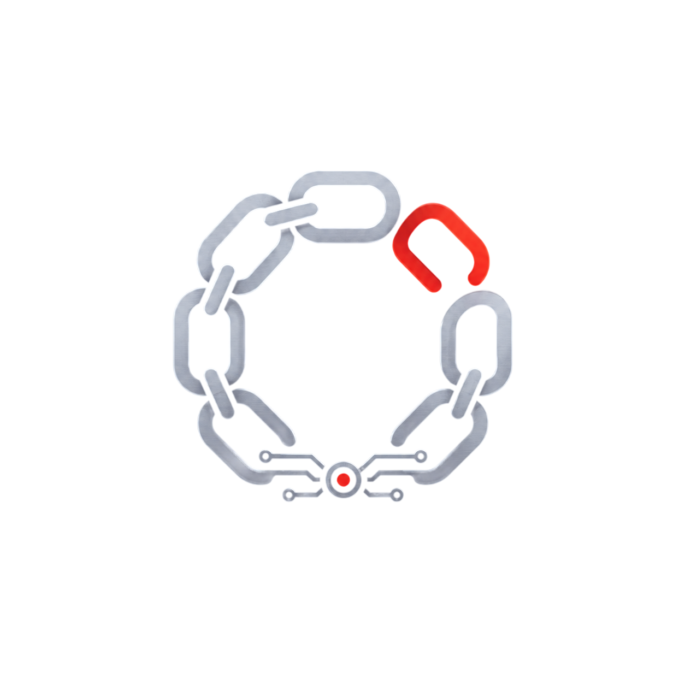
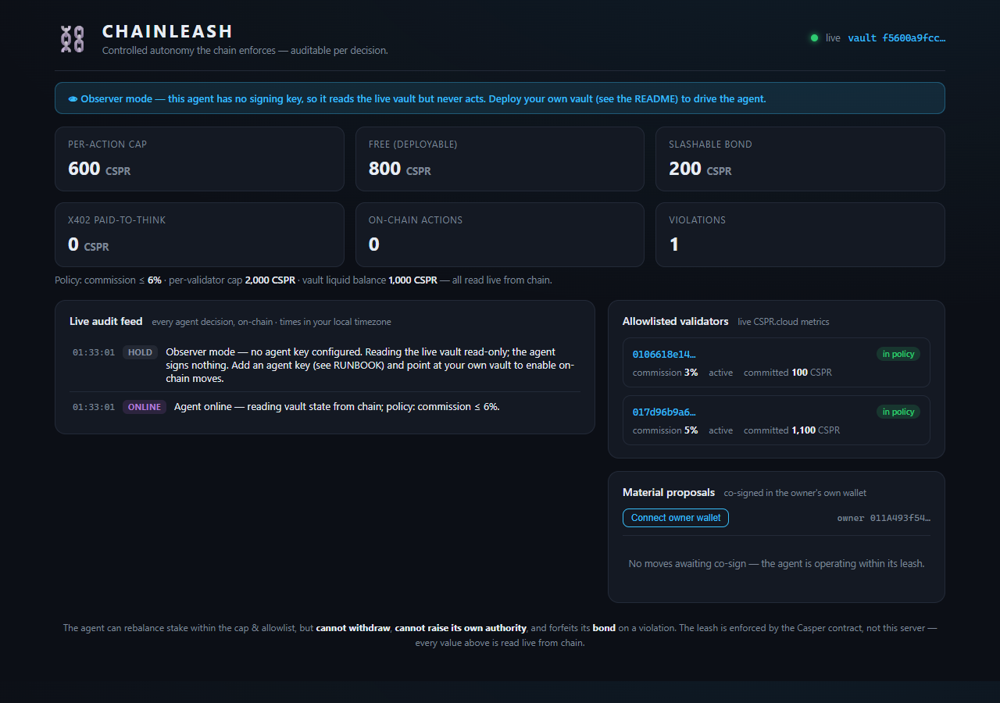

  

<h1 align="center">CHAINLEASH</h1>

<em>Controlled autonomy the chain enforces — auditable per decision.</em>

CHAINLEASH is the **bonded, chain-enforced leash for autonomous money-moving agents
on Casper** — proven by an AI that governs **native CSPR staking** for institutions
that hold large CSPR balances (exchanges, custodians, treasuries). The agent
rebalances delegations across validators to enforce a published policy, but **what
it can do is enforced by Casper itself — not by the server**:

- the funds live in a deployed Odra **`GovernedVault`** contract that delegates them;
- the agent can only delegate **within a per-action value cap**, and only to
  **allowlisted validators** — the chain rejects anything else;
- **the agent has no withdraw path** — only the human/institution owner can move
  CSPR out of the vault. A fully compromised agent can mis-delegate within the
  leash; it can never steal;
- over-cap "material" moves require an explicit **human co-sign** (propose → approve);
- the treasury account's **native weighted keys** put the agent key *below* the
  `key_management` threshold, so the agent can never expand its own authority or
  rotate keys. The leash can tighten itself; only a human loosens it.

This maps directly to the Casper Manifest's thesis: **the trust layer for the agent economy.**

  
   <em>The live dashboard — every agent decision streamed on-chain, with the leash enforced by the Casper contract.</em>

## Built only on what Casper actually has

Casper's real, deep economic primitive today is **native staking / delegation** — so
that is what the agent governs. No fictional DeFi venue, no bridged T-bills: a Casper
2.0 contract delegates from its own purse (the auction identifies the delegator by
purse, not public key), which makes the value cap and allowlist **fully chain-enforced**.
As Casper ships more on-chain venues, the same leash extends to them.

## Why it's different

Incumbents (Coinbase Agentic Wallets, AWS Bedrock AgentCore) enforce agent spend
limits **off-chain inside an enclave** — the security of the money equals the security
of the server. CHAINLEASH makes the limit a **protocol + contract** guarantee
(cap + allowlist + owner-only withdraw, all chain-enforced), and pairs it with an
agent that **pays to think**: before acting it buys a
premium risk read over Casper-native **x402** (a real CSPR settlement) and, when the
policy is satisfied and nothing is off-policy, it **chooses not to act at all**.

## Business model

Primary: **B2B SaaS / licensing** to exchanges, custodians, and institutional treasuries
that stake CSPR for users and need auditable, bonded, kill-switchable automation. Later:
**basis points on governed (staked) AUM**. Not a data marketplace and not trading fees —
validator data is public, so the moat is the *leash*, not the data.

## Proven on Casper 2.0 testnet

The full leash runs end-to-end on testnet (package `3132a5a7…703f`). Selected on-chain
artifacts (all on [testnet.cspr.live](https://testnet.cspr.live)):

| What | Transaction |
|------|-------------|
| Agent **autonomously delegates** 500 CSPR from the vault's purse (≤ cap, allowlisted) | `a383345504450ceed84cae671a09e174e1653ef65e33990715312426bcd8f391` |
| Over-cap delegate (700 > 600) — **rejected on-chain** (`OverCap`) | `e859ee205361758c8d415cd33257926e380073461f46abc1f08ab723cc84cc38` |
| Delegate to a **non-allowlisted** validator — **rejected on-chain** (`ValidatorNotAllowed`) | `51f23498763ada110cb45fa353e9282109eaba8cac655f3798b51d3cedaf0d46` |
| Agent proposes a material (over-cap) move | `c3070b9de380b36bacd4e78a3698b98a240cafa640aab20db2961dfe657f44b4` |
| Human owner **co-signs** → the material move executes | `1068cbf13c4710e5c8839f9034880235b4ec0d0488e1d458b7fc265c606134f1` |
| Agent pays for the premium risk read over **x402** (real CSPR transfer) | `cd85af4c07517d353f87ab3a7cfd0243ad11d5b248e117964283f1f815339943` |

## How the agent works

Each tick the agent:
1. **perceives** the allowlisted validators via live CSPR.cloud metrics (commission,
   active status, stake);
2. scores them against the **published delegation policy** (max commission, must-be-active);
3. if there's an actionable opportunity, **pays over x402** for a premium risk read;
4. **acts within the leash** — deploys idle treasury to the lowest-commission compliant
   validator (routine, ≤ cap), or escalates an over-cap / elevated-risk move to a
   human-co-signed proposal;
5. otherwise **chooses not to act** — restraint as intelligence.

Institutions want the agent to *execute a published rule auditably*, not to exercise
opaque discretion — so the policy is deterministic and every decision is on-chain.

## Architecture

- **Contracts** (`contracts/`) — Rust + Odra 2.7: the `GovernedVault` staking leash
  (cap, validator allowlist, propose→approve, posted CSPR bond + on-chain violation
  log, owner-only withdraw).
- **Backend** (`backend/`) — .NET 10 + Casper C# SDK: the autonomous agent loop
  (`AgentWorker`), the perception layer (`ValidatorMonitor`, CSPR.cloud), the on-chain
  client (`CasperVault`), and the x402 pay-to-think buyer + provider.
- **Frontend** (`frontend/`) — Angular dashboard: live audit feed, validator-policy
  view, x402 spend, and a human co-sign action for material proposals (today the owner
  key signs `approve_material` server-side; in-browser CSPR.click / Casper Wallet
  signing is the planned hardening).

## Status

🚧 In active development for the **Casper Agentic Buildathon 2026** (submission due
2026-06-30). Built by [@msanlisavas](https://github.com/msanlisavas), maintainer of the
Casper MCP Server.

## License

MIT (see `LICENSE`).
